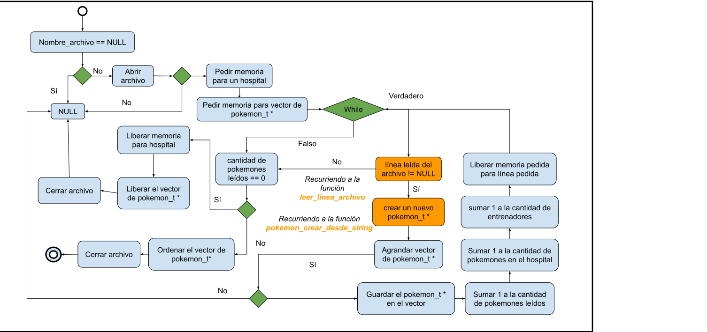
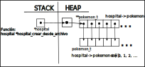

<div align="right">

</div>

# TP1

## Repositorio de Michelle Melisa Chen - 105506 - mchen@fi.uba.ar

- Para compilar:

```bash
línea de compilación
```

- Para ejecutar:

```bash
línea de ejecución
```

- Para ejecutar con valgrind:
```bash
línea con valgrind
```
---
##  Funcionamiento

Explicación de cómo funcionan las estructuras desarrolladas en el TP y el funcionamiento general del mismo.

Aclarar en esta parte todas las decisiones que se tomaron al realizar el TP, cosas que no se aclaren en el enunciado, fragmentos de código que necesiten explicación extra, etc.

Incluír **EN TODOS LOS TPS** los diagramas relevantes al problema (mayormente diagramas de memoria para explicar las estructuras, pero se pueden utilizar otros diagramas si es necesario).

### Por ejemplo:

El programa funciona abriendo el archivo pasado como parámetro y leyendolo línea por línea. Por cada línea crea un registro e intenta agregarlo al vector. La función de lectura intenta leer todo el archivo o hasta encontrar el primer error. Devuelve un vector con todos los registros creados.

<div align="center">

</div>

En el archivo `sarasa.c` la función `funcion1` utiliza `realloc` para agrandar la zona de memoria utilizada para conquistar el mundo. El resultado de `realloc` lo guardo en una variable auxiliar para no perder el puntero original en caso de error:

```c
int *vector = realloc(vector_original, (n+1)*sizeof(int));

if(vector == NULL)
    return -1;
vector_original = vector;
```


<div align="center">

</div>

---

## Respuestas a las preguntas teóricas

## --- hospital_t *hospital_crear_desde_archivo (const char *nombre_archivo) ---

El siguiente diagrama ilustra brevemente cómo funciona la función: 

<div align="center">

</div>

En la función pido memoria con `malloc` para la variable `hospital` del tamaño de un
`struct _hospital_pkm_t`. Pido memoria también para la variable `**pokemones` en 
`struct _hospital_pkm_t`. Inicializo los otros variables a 0.   

```c
	struct _hospital_pkm_t *hospital =
		malloc(1 * sizeof(struct _hospital_pkm_t));
	hospital->pokemones = malloc(1 * sizeof(pokemon_t *));
	hospital->cantidad_pokemon = 0, hospital->cantidad_entrenadores = 0;
```
<div align="center">

</div>

En un `while` loop mientras la línea devuelta por la función `leer_linea_archivo(archivo)` no sea `NULL`
uso la función `pokemon_crear_desde_string(linea)` para crear un pokemon nuevo. Agrando el tamaño del 
vector de `pokemon_t *` por uno y cargo el nuevo pokemon en el vector. 

```c
	while ((linea = leer_linea_archivo(archivo)) != NULL) {
		pkm_creado = pokemon_crear_desde_string(linea);
		pokemon_t **pkm_aux =
			realloc(hospital->pokemones,
				(cant_pkm + 1) * sizeof(pokemon_t *));

		if (pkm_aux == NULL)
			return NULL;

		hospital->pokemones = pkm_aux;
		hospital->pokemones[cant_pkm] = pkm_creado;
		cant_pkm++;
		hospital->cantidad_pokemon += 1;
		hospital->cantidad_entrenadores += 1;
		free(linea);
	}
```
Incremento a la variable `cant_pkm` por uno, para contar la cantidad de pokemones creados. 
Incremento en uno `cantidad_pokemon` y `cantidad_entrenadores`. Libero la memoria pedida en la función 
`leer_linea_archivo(archivo)` que no fue liberada con la línea `free(linea)` al final de cada ciclo. 
En la función `pokemon_t *pokemon_crear_desde_string(const char *string)` del archivo `pokemon.c`, se
pidió memoria con `pokemon_t *nuevo_pkm = malloc(1 * sizeof(pokemon_t))` para crear un nuevo `pokemon_t`.
La función devuelve el pokemon creado por lo que la memoria se libera en la función `hospital_t *hospital_crear_desde_archivo(const char *nombre_archivo)` que es donde la llama. 

<div align="center">

</div>

Si la cantidad de pokemones creados es nulo, es decir, si `cant_pkm` vale 0, no se creó ningún pokemon. 
Podríamos decir que no se pudo leer las lineas del archivo. Deveríamos devolver `NULL`. Pero antes de 
eso deberíamos liberar la memoria pedida en el principio de la función para la variable `hospital`y 
`hospital->pokemones`. Y cerrar el archivo abierto con `fclose`. 

```c
	if (cant_pkm == 0) {
		free(hospital->pokemones);
		free(hospital);
		fclose(archivo);
		return NULL;
	}
```
En el caso de que los pokemones leídos no fuera `NULL` se ordena los pokemones del hospital con 
la función `void ordenar_pokemones(hospital_t *hospital)` y se cierra el archivo con `fclose`.
Se libera ni `hospital` ni `hospital->pokemones` porque se devuelve el puntero a hospital. 

## --- void ordenar_pokemones(hospital_t *hospital) ---

Para ordenar el vector de `hospital->pokemones` implementé una función de insertion sort. 

## --- char *leer_linea_archivo(FILE *archivo) ---

Reservo memoria con `malloc` para el vector de `char *`. Leo los caracteres de cada línea
utilizando `fgetc` y `while` loop. Pido más memoria del tamño de `char` para cada caracter
leído con `realloc`. Al finalizar la lectura de una línea, agrego un 0 para el fin del string
de char. 

Si no llego a leer ningún caracter, es decir, `cant_c_leidos == 0` debería liberar la memoria
pedida antes de hacer `return`. 

<div align="center">

</div>